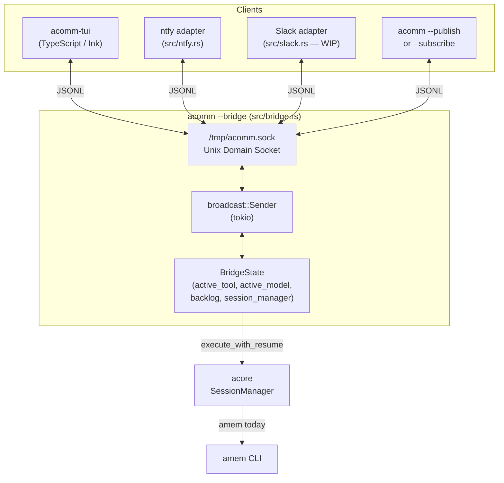

# acomm

Communication hub for AI agents and human interaction.

`acomm` acts as the nervous system of the `yuiclaw` project, orchestrating AI agent CLIs and providing real-time communication via a bridge + TUI architecture.

- **Bridge Architecture**: Decouples UI clients from agent execution via Unix Domain Sockets.
- **Real-time Streaming**: Delivers agent responses in chunks as they are generated.
- **Rich TUI**: CJK-aware multiline input with Emacs keybindings and interactive slash commands.
- **Unified Protocol**: JSONL event bus connecting TUI, CLI, and adapter channels (ntfy, Slack, Discord).
- **Multi-channel**: ntfy.sh and Discord adapters supported; Slack adapter in progress.

## Architecture



### Components

- **Bridge** (`src/bridge.rs`) — Central pub/sub hub on `/tmp/acomm.sock`. Receives `Prompt` events, dispatches them to `acore`, and broadcasts `AgentChunk`/`AgentDone` back to all subscribers. Handles slash commands (`/provider`, `/model`, `/clear`, `/search`, `/today`).
- **TypeScript TUI** (`tui/`) — Primary interactive interface built with [Ink](https://github.com/vadimdemedes/ink). Handles all user interaction including slash command menus.
- **Rust TUI** (`src/tui.rs`) — Legacy interface (deprecated; kept for backwards compatibility).
- **ntfy adapter** (`src/ntfy.rs`) — Bidirectional adapter for ntfy.sh push notifications.
- **Slack adapter** (`src/slack.rs`) — Stub; Socket Mode implementation planned.

## Install

Install from source (recommended via `yuiclaw` Makefile):

```bash
# From the yuiclaw repo — installs all components including acomm and acomm-tui
make install
```

Or install `acomm` directly:

```bash
cargo install --path .
# TypeScript TUI:
cd tui && npm install && npm link
```

## Usage

```bash
acomm-tui           # Start the TypeScript TUI (preferred)
acomm               # Start the legacy Rust TUI
acomm --bridge      # Start bridge only (background hub)
acomm --publish "Hello"  # Send one message, then exit
acomm --subscribe   # Stream all events to stdout
```

### Discord Adapter

- Required: `DISCORD_BOT_TOKEN`
- Optional: `DISCORD_ALLOWED_USER_IDS` (comma-separated Discord user IDs)
  - When set, `acomm --discord` ignores messages from users not in the list.
- Default agent session preset on bridge startup (useful for Discord):
  - Provider: `gemini`
  - Model: `gemini-2.5-flash-lite`
- Discord-only magic words (to avoid `/` slash-command collisions):
  - `p-gemini` → switch to `gemini:gemini-2.5-flash-lite`
  - `p-codex` → switch to `codex:gpt-5.3-codex`
  - `p-claude` → switch to `claude:claude-sonnet-4-6`
- Discord replies sent after agent completion include a trailing status suffix such as:
  - `__gemini:gemini-2.5-flash-lite__`

## TUI (acomm-tui)

### Global keys

| Key | Action |
|---|---|
| `q` | Quit (only when input field is empty) |
| `1` – `4` | Switch tool: Gemini, Claude, Codex, OpenCode |

### Input keys

| Key | Action |
|---|---|
| `Enter` | Submit message |
| `Shift+Enter` / `Alt+Enter` / `Ctrl+J` | Insert newline |
| `Backspace` | Delete character |
| `← →` | Move cursor |
| `↑ ↓` | Move to previous/next logical line |
| `Ctrl+A` / `Home` | Start of line |
| `Ctrl+E` / `End` | End of line |
| `Ctrl+P` / `Ctrl+N` | History up / down |

### Slash commands

Type these in the input field and press **Enter**:

| Command | Effect |
|---|---|
| `/provider` | Open interactive provider selection menu (↑/↓ + Enter to confirm) |
| `/model` | Open model selection menu for the current provider |
| `/clear` or `/reset` | Clear local message history and reset the bridge session |
| `/provider <name>` | Switch provider directly (forwarded to bridge) |
| `/search <query>` | Search amem memory (forwarded to bridge) |
| `/today` | Show today's amem snapshot (forwarded to bridge) |

#### Provider selection menu (`/provider`)

Displays all available providers. Navigate with `↑`/`↓`, confirm with `Enter`, cancel with `Esc` or `q`. If a session already exists for the selected provider, it is resumed automatically. The amem context is re-injected on the seed turn.

#### Model selection menu (`/model`)

Shows models available for the active provider:

| Provider | Models |
|---|---|
| Gemini | gemini-2.5-flash, gemini-2.5-pro, gemini-2.0-flash |
| Claude | claude-opus-4-6, claude-sonnet-4-6, claude-haiku-4-5 |
| Codex | gpt-4o, gpt-4o-mini, o1-mini |
| OpenCode | default |

## Bridge Slash Commands

Commands sent as `Prompt` events starting with `/` are interpreted by the bridge instead of being forwarded to the AI:

| Command | Bridge action |
|---|---|
| `/provider <name>` | Broadcast `ProviderSwitched` event |
| `/model <name>` | Broadcast `ModelSwitched` event |
| `/clear` | Clear backlog, reset `SessionManager`, reset active model |
| `/search <query>` | Run `amem search <query>`, broadcast `SystemMessage` with results |
| `/today` | Run `amem today`, broadcast `SystemMessage` with output |

## Protocol (JSONL)

Events exchanged over the Unix socket, one JSON object per line:

| Event | Direction | Fields |
|---|---|---|
| `Prompt` | Client → Bridge | `text`, `tool` (nullable), `channel` (nullable) |
| `AgentChunk` | Bridge → Client | `chunk`, `channel` |
| `AgentDone` | Bridge → Client | `channel` |
| `SystemMessage` | Bridge → Client | `msg`, `channel` |
| `StatusUpdate` | Bridge → Client | `is_processing`, `channel` |
| `SyncContext` | Bridge → Client | `context` (amem snapshot on connect) |
| `ProviderSwitched` | Bridge → Client | `tool` |
| `ModelSwitched` | Bridge → Client | `model` |

On connect, the bridge sends:
1. `SyncContext` (current amem snapshot)
2. `ProviderSwitched` (restore active tool)
3. `ModelSwitched` (restore active model, if set)
4. Backlog replay (last 100 events)

## Runtime Layout

- `/tmp/acomm.sock` — Unix Domain Socket for bridge communication.
- `~/.cache/acomm/sessions/` — Daily JSONL session logs.
- `~/.cache/acomm/history.txt` — Persistent TUI input history.

## Development

```bash
# Rust
cargo fmt
cargo test   # 9 Rust tests

# TypeScript TUI
cd tui
npm test     # 83 TypeScript tests (vitest)
npx tsc --noEmit   # type check
```

### ADR

- See `docs/ADR/` for architecture decision records.
